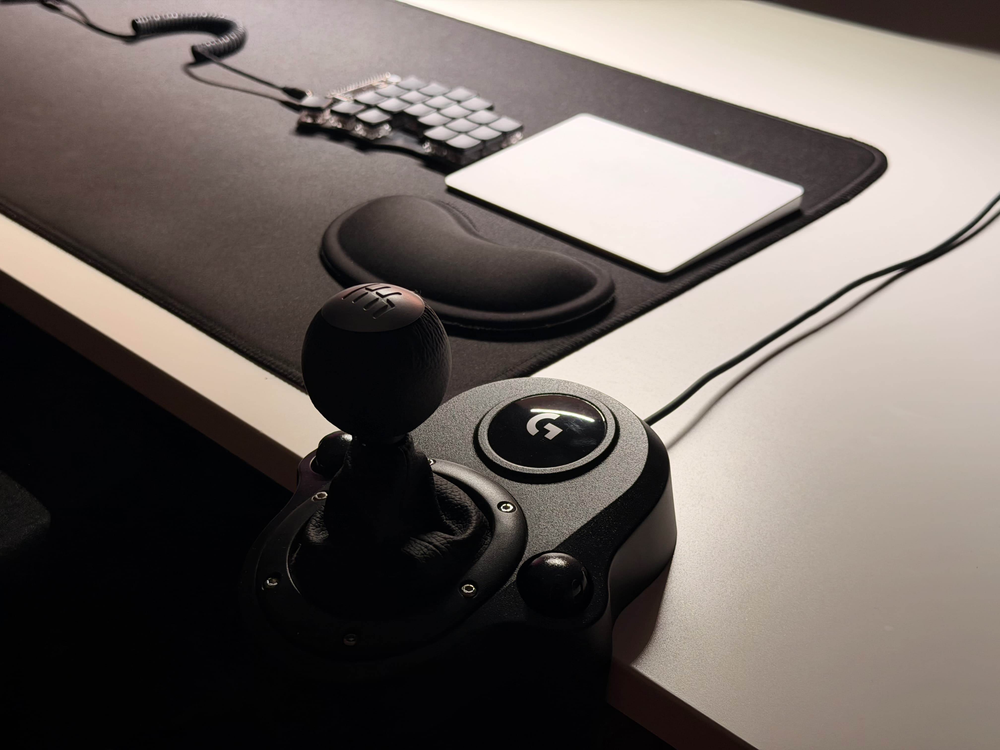
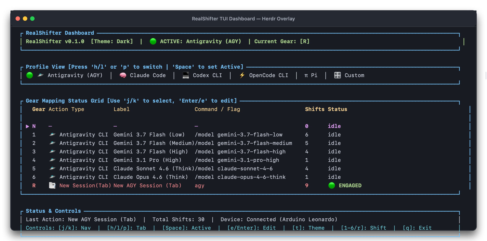

# 🏎️ RealShifter

**RealShifter** is a hardware-driven context & model switching plugin for [Herdr](https://github.com/ergenekonyigit/herdr). It maps **USB H-pattern manual gear shifters** (Logitech Driving Force Shifter) and hotkeys to model switches, effort tiers, and prompt actions across AI coding CLIs.

<p align="center">
  
</p>

<p align="center">
  
</p>

---

## Key Features

- **Hardware H-Pattern Shifting** — Map physical gears on Logitech USB shifters to LLM model profiles.
- **Multi-CLI Support** — AGY, Claude Code, Codex CLI, OpenCode CLI, and Pi Agent.
- **Reverse Gear = New Session** — Engaging Reverse opens a new Herdr tab with a fresh CLI session.
- **Hotkey Fallbacks** — Full keyboard support without hardware (`Ctrl+Shift+1..6`, `Ctrl+Shift+R`, `Ctrl+Shift+P`).
- **TUI Dashboard** — Interactive terminal UI for live gear status, device monitoring, and profile editing.
- **DIY USB Adapter** — Arduino-based, solder-free, ~$10, ~10 minutes. See the [Hardware Guide](docs/hardware-guide.md).

---

## Getting Started

### Prerequisites

- **OS**: macOS (native HID support), Linux, or Windows
- **Rust Toolchain**: 1.80+ (`cargo`, `rustc`)
- **Herdr**: `v0.7.0` or higher
- **Hardware**: Logitech Driving Force Shifter + Arduino USB Adapter _(optional — hotkeys work without hardware)_

### Build from Source

```bash
git clone https://github.com/ergenekonyigit/herdr-real-shifter.git
cd herdr-real-shifter
cargo build --release
```

Compiled binaries go to `./target/release/`: `realshifter-daemon`, `realshifter-tui`, `realshifter-action`.

---

## Usage

### 1. Register with Herdr (Recommended)

```bash
herdr plugin link .
```

Herdr will automatically:

- Compile release binaries.
- Launch `realshifter-daemon --detach` in the background.
- Register the TUI dashboard overlay pane.
- Map keybindings: `Ctrl+Shift+1..6`, `Ctrl+Shift+R` (Reverse / New Session), `Ctrl+Shift+P` (Cycle Profile).

### 2. Manual Action Execution

```bash
# Shift to Gear 1
realshifter-action shift 1

# Shift to Reverse (opens new Herdr tab + CLI session)
realshifter-action shift reverse

# Cycle active CLI profile (AGY -> Claude -> Codex -> OpenCode -> Pi)
realshifter-action profile next
```

### 3. Interactive Dashboard (TUI)

```bash
realshifter-tui
```

---

## Architecture

```
herdr-real-shifter/
├── crates/
│   ├── realshifter-core/     # Core domain logic, gear mapping, state management, profiles
│   ├── realshifter-daemon/   # HID USB listener & background event loop daemon
│   ├── realshifter-tui/      # Ratatui TUI dashboard interface
│   └── realshifter-action/   # CLI action runner & IPC trigger binary
├── firmware/
│   ├── logitech_shifter_usb/            # Arduino Leonardo USB firmware
│   └── diagnostic_serial_calibrator/    # Serial calibration & diagnostic sketch
├── skills/
│   └── realshifter/          # AGY skill for model discovery & auto-sync
└── herdr-plugin.toml         # Herdr plugin manifest
```

---

## Configuration

Profiles live in `~/.config/realshifter/profiles/` (or `$HERDR_PLUGIN_CONFIG_DIR/profiles/`):

| File                     | Purpose                                                             |
| :----------------------- | :------------------------------------------------------------------ |
| `config.json`            | Global settings (`test_mode`, `preferred_terminal`, active profile) |
| `profiles/agy.json`      | Antigravity model mappings                                          |
| `profiles/claude.json`   | Claude Code profile                                                 |
| `profiles/codex.json`    | Codex CLI profile                                                   |
| `profiles/opencode.json` | OpenCode CLI profile                                                |
| `profiles/pi.json`       | Pi Coding Agent profile                                             |
| `profiles/custom.json`   | User-defined custom commands                                        |

### Gear Mapping Structure

```json
{
  "profile": "AgyCli",
  "mappings": [
    {
      "gear": "Gear1",
      "action_type": "AgyCli",
      "model": "gemini-3.7-flash-low",
      "label": "Gemini 3.7 Flash (Low)",
      "is_enabled": true
    }
  ]
}
```

See the full [Profile Reference](docs/profiles.md) for all gear-to-model mappings across supported CLIs.

---

## Hardware (Optional)

RealShifter works with a Logitech Driving Force Shifter connected via a DIY Arduino USB adapter. No soldering required — build takes ~10 minutes for ~$10.

See the [Hardware Guide](docs/hardware-guide.md) for wiring, firmware, calibration, and troubleshooting.

---

## Agent Skill

RealShifter ships with an OpenAI-compatible `realshifter` skill for model discovery, profile sync, and gear shifting. Works with Codex CLI, AGY, and any agent that supports the OpenAI skill format.

```
skills/realshifter/
├── SKILL.md              # Skill instructions (name, description, workflow)
└── agents/
    └── openai.yaml       # OpenAI-compatible metadata & invocation policy
```

Install globally:

```bash
cp -r skills/realshifter ~/.agents/skills/realshifter
```

Once installed, agents can invoke `realshifter` to:

1. Discover available models and effort tiers for the active CLI.
2. Sync the snapshot into the matching profile under `~/.config/realshifter/profiles/`.
3. Execute gear shifts via `realshifter-action`.

---

## License

Distributed under the MIT License. See `LICENSE` for details.
